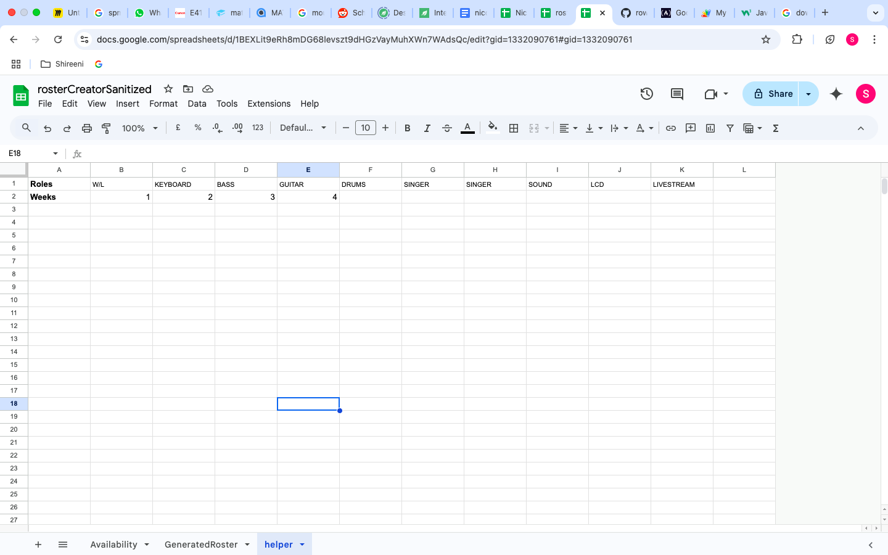
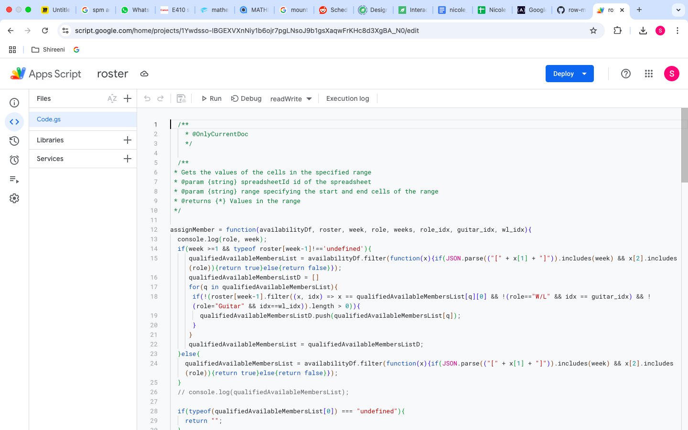
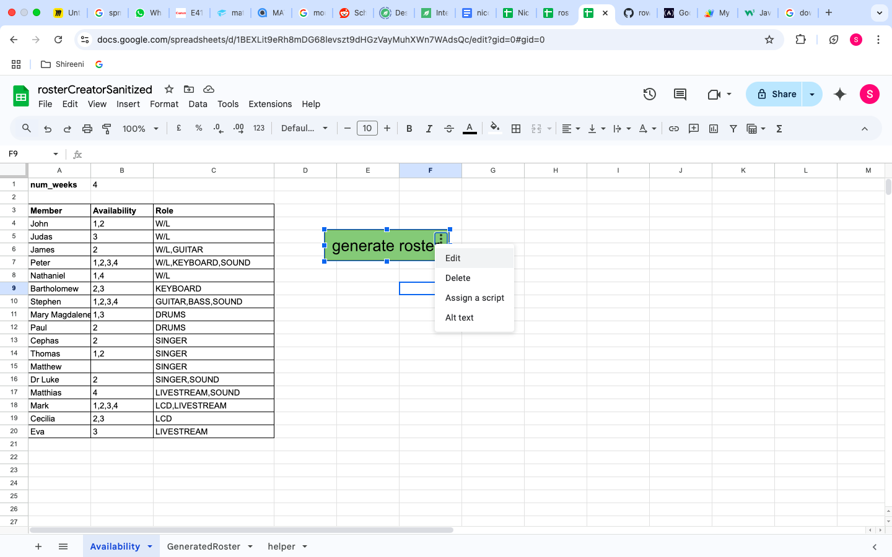
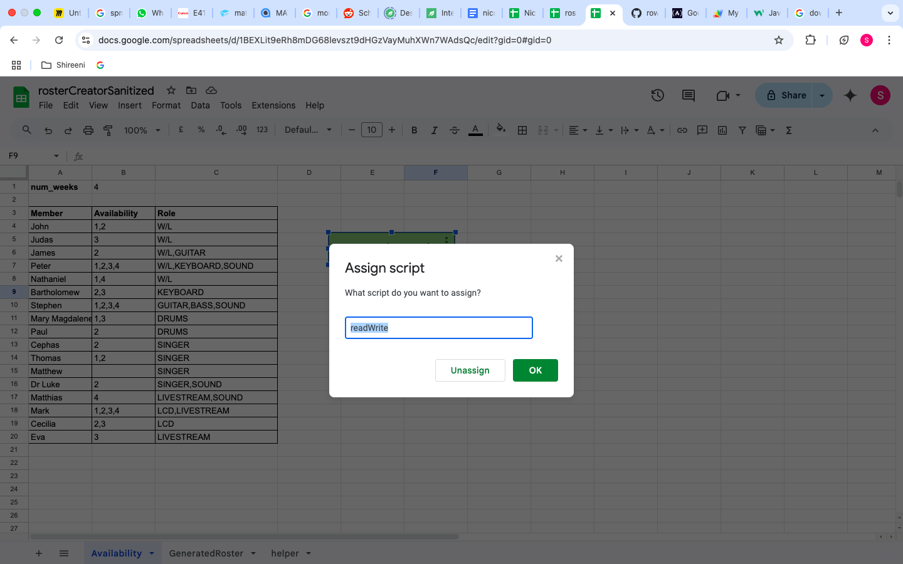
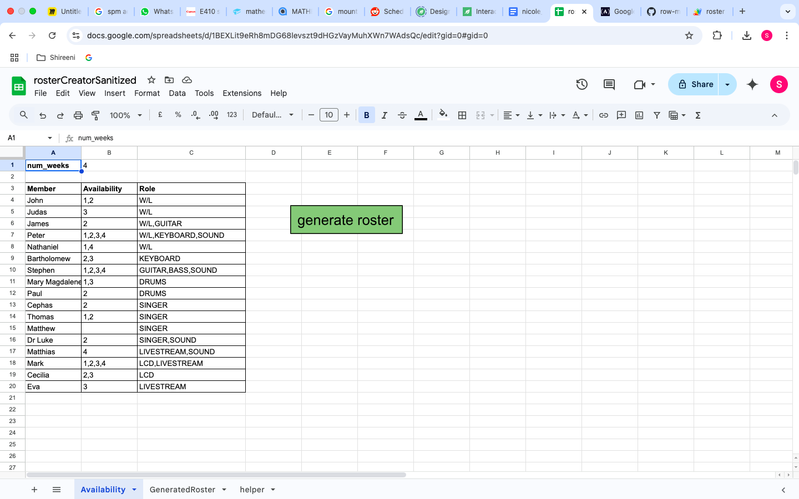
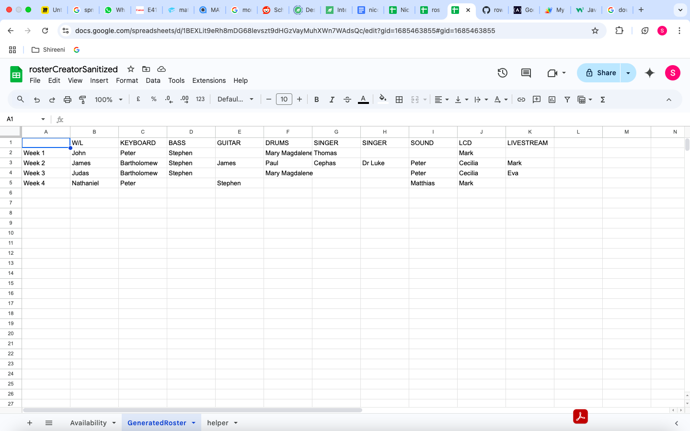

# row-music-team-rostering-automation

This is a script for automating the assignment of members of a church band for a weekly service.

Members can provide their availability for a given week, and the script will generate a roster.

# How to Set Up

1. Upload the rosterCreatorSanitized spreadsheet to Google sheets.
2. Update the params (if required) in the hidden "helper" tab. 
3. From within Google Sheets, click Extensions > Apps Script 
4. Copy the contents of Code.gs into the Apps Script project 
5. Create a drawing/image, then right click > Assign a Script > type "readWrite"  

# How to use
1. You can update the availability of the different members from the "Availability" sheet 
1. After that, you should be able to click the drawing to trigger the generation of the roster which will be outputted to the "GeneratedRoster" sheet. 
